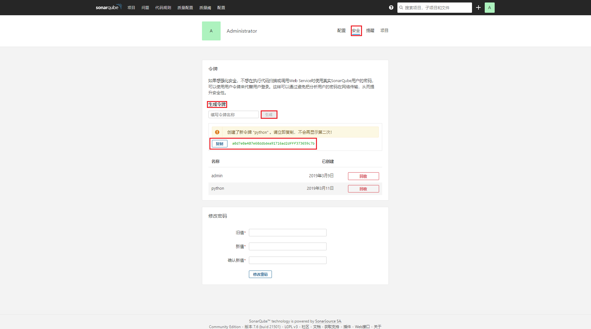

# SonarQube+Jenkins+Gitlab

## SonarQube 配置

### mysql数据库配置

用root账号登陆mysql，并执行以下命令

```mysql
DROP DATABASE sonar;

CREATE DATABASE sonar CHARACTER SET utf8 COLLATE utf8_general_ci;

CREATE USER 'sonar' IDENTIFIED BY 'sonar';

GRANT ALL ON sonar.* TO 'sonar'@'%' IDENTIFIED BY 'sonar';

GRANT ALL ON sonar.* TO 'sonar'@'localhost' IDENTIFIED BY 'sonar';

FLUSH PRIVILEGES;
```

>SonarQube扫描项目产生的文件过大时，会造成“Caused by: com.mysql.jdbc.PacketTooBigException: Packet for query is too large (8773805 > 4194304). You can change this value on the server by setting the max_allowed_packet' variable.”错误，产生原因时往MySQL数据库插入数据时超过了设置的最大允许数据包值：max_allowed_packet。
>
>解决方法：root账号登入MySQL命令行，执行`set global max_allowed_packet = 100*1024*1024;`。

### 插件安装

SonarQube的版本为7.6版本，去[Community plugins for SonarQube](https://github.com/SonarQubeCommunity?utf8=%E2%9C%93&q=&type=&language)下载对应版本的插件。重新打包镜像到指定目录，启动镜像，插件自动加载。

Dockerfile如下所示：

```dockerfile
FROM docker.io/sonarqube
ADD sonar-l10n-zh-plugin-1.26.jar /opt/sonarqube/extensions/plugins/
```

### docker运行

```shell
$ docker run -d --name sonarqube \
    -p 9000:9000 \
    -e sonar.jdbc.username=sonar \
    -e sonar.jdbc.password=sonar \
    -e sonar.jdbc.url="jdbc:mysql://10.134.171.50:3306/sonar??useUnicode=true&characterEncoding=utf8&rewriteBatchedStatements=true" \
    docker.io/sonarqube
```

访问SonarQubeIP:9000，默认用户名为admin，密码admin。

### 项目权限管理

参考文档：[sonarqube项目按权限分配](https://blog.csdn.net/danielchan2518/article/details/72792897)

## Jenkins配置

### 安装SonarQube插件

在[Plugins Index](https://plugins.jenkins.io/)搜索`SonarQube Scanner`，并选择最新版本，下载到本地。


管理员账号登入Jenkins，进入`系统管理`>`管理插件`>`高级`>`上传插件`页面。选择本地插件文件并下载上传至Jenkins，自动安装。


### 配置SonarQube servers

管理员账号登入Jenkins，进入`系统管理` >`系统设置`>`SonarQube servers`, 点击`Add SonarQube` 按钮，点击`高级`即可出现配置项。

配置方式分成两种：

1. SonarQube版本低于5.2，CI平台的登陆权限验证使用`sonar.login`和`sonar.password`的API 。

   

2. SonarQube版本升级到5.3以后，CI平台中的登录权限验证使用`Server authentication token`。

   以下是获取Sonar平台authentication token的过程和jenkins平台sonar server配置的过程。

   管理员账户登陆SonarQube，进入`配置`>`通用设置`>`权限`，将`Force user authentication`置为`真`。

   

   进入`配置`>`通用设置`>`SCM`中将`Disable the SCM Sensor`设置为`真`

   

   然后点击右上角的用户图标，选择`我的账号`，进入个人账号设置页面，选择`安全`。在`生成令牌`中填入一个令牌名，点击`生成`。复制生成好的token。

   

最后转至Jenkins，`Server authentication token`这一项空着不填。


### 安装Sonar-Scanner

去[官网](https://docs.sonarqube.org/display/SCAN/Analyzing+with+SonarQube+Scanner)下载对应环境的Sonar-Scanner的源码压缩包至本地。


管理员账号登入Jenkins，进入`系统管理`>`全局工具配置`>`Sonar-Scanner`，点击`Sonar-Scanner安装`按钮。在无外网的环境下可将安装包拷贝到服务器的指定目录下，解压。`SONAR_RUNNER_HOME`指向该目录，Jenkins会检测该目录是否存在。若可连外网，即可用自动安装选项。


### 项目配置Sonar

方案一

使用`构建一个自由风格的软件项目`创建一个demo项目


在`源码管理`中选择`Git`，填入项目的地址


点击`Credentials`右侧的`add`按钮，添加鉴权验证。选择`SSH Username with private key`>`Enter directly`，在`Key`总填入git shh-key私钥。


在`构建触发器`中`触发远程构建`，写入`身份验证令牌`,即token


登入GitLab，进入`Settings`>`Integrations`,在`Tigger`中的`Push events`填入需要触发的分支。如测试分支为`test`，则填入`test`。


在`构建`中`点击增加构建步骤`按钮，选择`Execute SonarQube Scanner`。设置如下所示


- `Task to run`可不填，空白为混合扫描。
- `JDK` 选择 SonarQube Scanner 使用的 JDK（注意这里必须是 JDK 不能是 JRE）。在`JDK`选项中若没有下拉项，则在`系统管理`>`全局工具配置`>`JDK`中配置本地JDK路径。
- `Path to project properties`填写`sonar-scanner.properties`文件在项目中路径，如果不指定的话会使用项目默认的 properties文件。
- `Analysis properties`，需要输入一些配置参数用来传递给 SonarQube，这里的参数优先级高于`sonar-project.properties`文件里面的参数，所以可以在这里来配置所有的参数以替代`sonar-project.properties`文件。填写规则见<a href="#生成测试报告与覆盖率">生成测试报告与覆盖率</a>
- `Additional arguments` 输入框中可以输入一些附加的参数，示例中的`-X` 意思是进入SonarQube Scanner的Debug 模式，这样会输出更多的日志信息。
- `JVM Options` 可以输入在执行 SonarQube Scanner是需要的JVM参数

方案二

使用`jenkinsfile`

参考文档：[Analyzing with SonarQube Scanner for Jenkins](https://docs.sonarqube.org/display/SCAN/Analyzing+with+SonarQube+Scanner+for+Jenkins)


## 代码质量扫描与生成测试报告与覆盖率

### 代码质量扫描

扫描配置参数

```powershell
#填入在SonarQube中生成的访问令牌 token
sonar.login=a0d7e0a407e60ddbdea91716ad2dfff373659c7b
# 在 SonarQube 中唯一的KEY,若项目名不重复，则可默认项目名
sonar.projectKey=p_test
# SonarQube UI上显示的项目名，java项目推荐使用pom.xml中的配置
sonar.projectName=p_test
# java项目推荐使用${VER}获取当前版本
sonar.projectVersion=1.0
# 项目文件编码方式
sonar.sourceEncoding=UTF-8
# git的权限认证SonarQub中已设置忽略
# sonar.svn.username=***
# 需要扫描的代码所在文件夹
sonar.sources=main/
# 指定需要检测的语言，默认空白为混合扫描
sonar.language=py
```

>`Analysis properties`参考文档：[Analysis Parameters](https://docs.sonarqube.org/latest/analysis/analysis-parameters/)

### 生成测试报告与覆盖率

#### Java

项目`pom.xml`添加如下配置(添加及配置jacoco插件)，各插件版本根据项目的实际情况做出相应调整。

```xml
    <build>
        <plugins>
            <plugin>
                <groupId>org.springframework.boot</groupId>
                <artifactId>spring-boot-maven-plugin</artifactId>
            </plugin>
			<plugin>
                <artifactId>maven-compiler-plugin</artifactId>
                <version>3.1</version>
                <configuration>
                    <source>1.8</source>
                    <target>1.8</target>
                </configuration>
            </plugin>
            <plugin>
                <groupId>org.jacoco</groupId>
                <artifactId>jacoco-maven-plugin</artifactId>
                <executions>
                    <execution>
                        <id>pre-test</id>
                        <goals>
                            <goal>prepare-agent</goal>
                        </goals>
                    </execution>
                    <execution>
                        <id>post-test</id>
                        <phase>test</phase>
                        <goals>
                            <goal>report</goal>
                        </goals>
                    </execution>
                </executions>
            </plugin>
            <plugin>
                <groupId>org.apache.maven.plugins</groupId>
                <artifactId>maven-compiler-plugin</artifactId>
                <version>3.1</version>
                <configuration>
                    <encoding>UTF-8</encoding>
                </configuration>
            </plugin>
            <plugin>
                <groupId>org.mortbay.jetty</groupId>
                <artifactId>jetty-maven-plugin</artifactId>
                <version>8.1.16.v20140903</version>
                <configuration>
                    <stopPort>9966</stopPort>
                    <stopKey>foo</stopKey>
                    <scanIntervalSeconds>10</scanIntervalSeconds>
                    <webApp>
                        <contextPath>/p_test</contextPath>
                    </webApp>
                </configuration>
            </plugin>
        </plugins>
		<pluginManagement>
            <plugins>
                <plugin>
                    <groupId>org.jacoco</groupId>
                    <artifactId>jacoco-maven-plugin</artifactId>
                    <version>0.7.5.201505241946</version>
                </plugin>
            </plugins>
        </pluginManagement>
    </build>
	 <profiles>
        <profile>
            <id>coverage-per-test</id>
            <build>
                <plugins>
                    <plugin>
                        <groupId>org.apache.maven.plugins</groupId>
                        <artifactId>maven-surefire-plugin</artifactId>
                        <version>2.9</version>
                        <configuration>
                            <!--忽略某个目录的测试代码 -->
                            <includes>
                                <include>**/*Test.java</include>
                            </includes>
                            <properties>
                                <property>
                                    <name>listener</name>
                                    <value>org.sonar.java.jacoco.JUnitListener</value>
                                </property>
                            </properties>
                            <systemPropertyVariables>
                                <jacoco-agent.destfile>target/jacoco.exec</jacoco-agent.destfile>
                            </systemPropertyVariables>
                        </configuration>
                    </plugin>
                </plugins>
            </build>
            <dependencies>
                <dependency>
                    <groupId>org.sonarsource.java</groupId>
                    <artifactId>sonar-jacoco-listeners</artifactId>
                    <version>3.8</version>
                    <scope>test</scope>
                </dependency>
                <dependency>
                    <groupId>org.jacoco</groupId>
                    <artifactId>org.jacoco.agent</artifactId>
                    <version>0.7.5.201505241946</version>
                    <scope>test</scope>
                </dependency>
            </dependencies>

```

进入`jenkins`>`<你的项目>`>`配置`，进入项目配置页面。


在`构建环境`>`构建`，点击`增加构建步骤`，选择`Execute shell`在`Command`对话框中填入mvn代码测试命令。


```shell
mvn clean org.jacoco:jacoco-maven-plugin:prepare-agent install -Dmaven.test.failure.ignore=true
```

然后点击`增加构建步骤`，选择`Execute SonarQube Scanner`。增加SonarQube的配置。

在`Analysis properties`中增加mvn编译形成的代码测试文件配置。


```powershell
sonar.login=a0d7e0a407e60ddbdea91716ad2dfff373659c7b
sonar.projectKey=demo
sonar.projectName=demo
sonar.projectVersion=${VER}
sonar.sourceEncoding=UTF-8
sonar.sources=src/main/java

# 测试文件坐在目录
sonar.tests=src/test/java
# java项目必配该项
sonar.java.binaries=target/classes
# 单元测试报告目录
sonar.junit.reportsPath=target/surefire-reports
# 代码覆盖率插件
sonar.java.coveragePlugin=jacoco
# jacoco.exec文件路径
sonar.jacoco.reportPath=target/coverage-reports/jacoco.exec
```

配置完成后点击`保存`，然后点击`立即构建`测试。

> 针对Java项目，在使用版本为4.12的`sonar-java`分析插件，在分析的时候提示"Please provide compiled classes of your project with sonar.java.binaries property"的问题。产生原因是由于新版`sonar-java`插件默认扫描java编译生成的.class文件，`sonar.java.binaries`即指向.class文件所在目录。对于不需要编译的项目，设置`sonar.java.binaries=.`即可跳过扫描。
>
> 参考文档：
>
> - [SonarJava](https://docs.sonarqube.org/display/PLUG/SonarJava)
> - [解决新版sonar-java插件需要配置sonar.java.binaries参数的问题](https://blog.csdn.net/Mrfive555/article/details/80013218)
> - [java应用测试报告生成(一): sonarqube配合Jenkins生成测试报告及覆盖率](https://www.cnblogs.com/garfieldcgf/p/5520368.html)
> - [Windows下配置SonarQube Scanner检测分析代码](https://blog.csdn.net/u012995964/article/details/82534305?utm_source=blogxgwz7)
> - [单元测试覆盖率（Jenkins+sonarqube）](https://blog.csdn.net/t3369/article/details/75664716)

#### python

SonarQube对python代码质量扫描使用了Pylint，现可以选择在jienkins中用Pylint扫描代码，然后将少秒结果配置，发送给SonarQube的API。或交给SonarQube自动完成。

##### 覆盖率

 对于Python代码项目，sonar的覆盖率需要通过python插件coverage来完成。大概的步骤即为通过coverage插件来生成coverage.xml文件，然后SonarQube Scanner扫描代码的时候就能将覆盖率报告传送到sonar系统了。而生成coverage.xml的方法我们可以通过coverage插件提供的coverage命令来完成，根据官方文档得知可以使用如下方法：

```powershell
coverage erase
coverage run --branch --source=<python packages> <program> 
coverage xml -i
```

按照上述命令执行后，得到了coverage.xml文件，然后修改sonar-project.properties配置文件。

##### 单元测试

Python里单元测试报告要借助nose，生成单元测试报告的方法为：

```shell
nosetests --with-xunit [tests to execute]
```

##### 使用总结


`Command`参数配置


```powershell
# /usr/local/python3.6/bin/coverage 是插件安装路径
/usr/local/python3.6/bin/coverage erase
# --source 指向项目文件，app/test/test.py是单元测试代码
/usr/local/python3.6/bin/coverage run --branch --source=app app/test/test.py
/usr/local/python3.6/bin/coverage xml -i
/usr/local/python3.6/bin/nosetests --with-xunit --with-xunit
echo "shell done"
```

`Analysis properties`参数配置


```powershell
sonar.login=a0d7e0a407e60ddbdea91716ad2dfff373659c7b
sonar.projectKey=demo
sonar.projectName=demo
sonar.projectVersion=1.0
sonar.sources=src
sonar.sourceEncoding=UTF-8

sonar.python.coverage.reportPath=*coverage-*.xml
sonar.python.xunit.reportPath=nosetests.xml
sonar.python.xunit.skipDetails=true
```

>参考文档：
>
>- http://www.5bug.wang/post/77.html
>- https://docs.sonarqube.org/display/PLUG/SonarPython


#### Web

web项目只做代码质量扫描。由于做单元测试的成本太高，不太建议对web项目使用单元测试。

Analysis properties`参数配置

```powershell
sonar.login=a0d7e0a407e60ddbdea91716ad2dfff373659c7b
sonar.projectKey=demo
sonar.projectName=demo
sonar.projectVersion=1.0
sonar.sources=app/
sonar.sourceEncoding=UTF-8
```

>注意：sonar.language不要指定成`web`，新版本的SonarQube在sonar.language不指定时会自动识别文件后缀，判断语言扫描标准。

## 参考文档

- [持续集成之代码质量管理-Sonar](https://www.cnblogs.com/ceshi2016/p/6529453.html)
- [Plugin Library](https://docs.sonarqube.org/display/PLUG/Plugin+Library)
- [sonarQube之jenkins可持续化集成](https://blog.csdn.net/songer_xing/article/details/76691438)
- [Python + Jenkins + SonarQube的持续集成](https://blog.csdn.net/u011170540/article/details/81639816)
- [Linux下安装sonarQube并配置Mysql数据库](https://blog.csdn.net/u013111003/article/details/82383333)
- [Sonar codereview平台配置搭建](https://blog.csdn.net/u011340807/article/details/20614467?utm_source=tuicool)